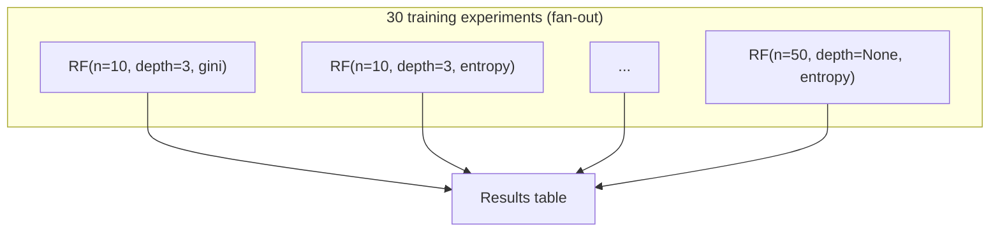

# Hyperparameter Tuning

A three-act demo showing GigQ solving a real data-science problem: grid-searching hyperparameters for a RandomForest classifier with parallel execution and crash-safe persistence.

**Requirements:**

```bash
pip install scikit-learn
# or:
pip install gigq[examples]
```

**Run it:**

```bash
python examples/hyperparameter_tuning.py
```

## What It Proves

| Act | What you see | What it proves |
| --- | --- | --- |
| **1 — Sequential** | 30 experiments, single thread, ~15 s | Baseline for comparison |
| **2 — Parallel** | Same 30 experiments, 8 threads, ~5 s | Concurrency works, ~3× speedup |
| **3 — Crash recovery** | Process half, stop, resume, finish | SQLite persistence — zero work lost |

## Architecture



## Task Definition

A single `@task`-decorated function defines the experiment. Options like `timeout` and `max_attempts` are fixed at decoration time:

```python
from gigq import task
from sklearn.ensemble import RandomForestClassifier
from sklearn.model_selection import cross_val_score

@task(timeout=120, max_attempts=2)
def train_experiment(dataset_path, n_estimators, max_depth, criterion):
    X, y = _load_dataset(dataset_path)
    clf = RandomForestClassifier(
        n_estimators=n_estimators,
        max_depth=max_depth,
        criterion=criterion,
        random_state=42,
        n_jobs=1,
    )
    scores = cross_val_score(clf, X, y, cv=5, scoring="accuracy")
    return {
        "params": {"n_estimators": n_estimators, "max_depth": max_depth, "criterion": criterion},
        "mean_accuracy": round(float(scores.mean()), 5),
        "std_accuracy": round(float(scores.std()), 5),
        "fold_scores": [round(float(s), 5) for s in scores],
    }
```

## Submitting a Grid Search

```python
import itertools
from gigq import JobQueue

grid = {
    "n_estimators": [10, 30, 50],
    "max_depth": [3, 5, 10, 20, None],
    "criterion": ["gini", "entropy"],
}
combos = list(itertools.product(*grid.values()))  # 30 combinations

queue = JobQueue("tuning.db")
for n_est, max_d, crit in combos:
    train_experiment.submit(
        queue, dataset_path=path, n_estimators=n_est, max_depth=max_d, criterion=crit,
    )
```

## Sequential vs Parallel

The demo runs the same 30 experiments twice — once with `concurrency=1`, once with `concurrency=8` — and compares:

```python
from gigq import Worker

# Act 1: sequential
worker = Worker("tuning.db", concurrency=1)
worker.start()

# Act 2: parallel
worker = Worker("tuning.db", concurrency=8)
worker.start()
```

## Crash Recovery

The most important act. GigQ writes every completed result to SQLite transactionally. The demo:

1. Submits 30 experiments
2. Processes ~half, then **stops the worker** (simulating a crash)
3. Inspects the database — completed results are safe on disk
4. Restarts the worker — only pending experiments run
5. All 30 results available. Zero work repeated.

```python
# After "crash", check what survived
queue = JobQueue("tuning.db")
stats = queue.stats()
# {'completed': 23, 'pending': 7, ...}

# Restart — picks up only the remaining 7
worker = Worker("tuning.db", concurrency=8)
worker.start()
```

## Sample Output

```
  GigQ: Hyperparameter Tuning
  ──────────────────────────────────────────────────────────

  ▸ Dataset     3,000 samples × 20 features
  ▸ Model       RandomForestClassifier
  ▸ Grid        30 combinations
  ▸ CV folds    5

  ──────────────────────────────────────────────────────────
  Act 1 · Sequential Baseline (concurrency=1)
  ──────────────────────────────────────────────────────────

  ▸ 30 experiments, single-threaded worker

  [███████████████████████████████████] ✓

  15.2s for 30 experiments

  ──────────────────────────────────────────────────────────
  Act 2 · Parallel (concurrency=8)
  ──────────────────────────────────────────────────────────

  ▸ 30 experiments, 8 threads

  [███████████████████████████████████] ✓

  4.9s for 30 experiments

  ──────────────────────────────────────────────────────────
  Speedup
  ──────────────────────────────────────────────────────────

  Sequential  ========================================  15.2s
  Parallel    ============............................   4.9s  ▸ 3.1× faster

  ──────────────────────────────────────────────────────────
  Act 3 · Crash Recovery
  ──────────────────────────────────────────────────────────

  ▸ 30 experiments submitted

  [█████████████████▓▓▓▓▓▓▓▓▓░░░░░░░░] 15/30

  ✖ Simulating crash — worker stopped.

  Checking database...
  ✓ 23 results safely persisted to SQLite
  ○ 7 experiments still pending

  ▸ Restarting worker...

  [███████████████████████████████████] ✓

  ✓ All 30 experiments finished. Zero work repeated.

  ──────────────────────────────────────────────────────────
  Results
  ──────────────────────────────────────────────────────────

    #   n_est   depth   criterion          accuracy
  ───  ──────  ──────  ──────────  ────────────────
 ★ 1      50      20     entropy  0.93867 ± 0.00476
   2      50      10        gini  0.93800 ± 0.00865
   3      50    None     entropy  0.93800 ± 0.00618
   4      50    None        gini  0.93700 ± 0.00726
   5      50      20        gini  0.93667 ± 0.00816

  ──────────────────────────────────────────────────────────
  Best Model
  ──────────────────────────────────────────────────────────

    n_estimators=50  max_depth=20  criterion=entropy
    accuracy = 0.93867 ± 0.00476
    folds    = [0.945, 0.932, 0.940, 0.935, 0.942]
```

## Why Not Just Use GridSearchCV?

`GridSearchCV` runs in-process. If your kernel crashes, notebook dies, or you hit Ctrl+C — all progress is lost. GigQ gives you:

- **Crash safety** — every completed experiment persists to SQLite immediately
- **Resumability** — restart the worker, only pending experiments run
- **Visibility** — query `queue.stats()` or `queue.get_result(job_id)` at any time
- **Concurrency control** — tune the number of threads without changing your code

## Optional Dependency Pattern

The script handles the optional scikit-learn import gracefully:

```python
try:
    from sklearn.ensemble import RandomForestClassifier
    from sklearn.model_selection import cross_val_score
except ImportError:
    print("This example requires scikit-learn.")
    print("Install it with:  pip install scikit-learn")
    sys.exit(1)
```

GigQ itself remains zero-dependency.

## Source

Full runnable script: [`examples/hyperparameter_tuning.py`](https://github.com/kpouianou/gigq/blob/main/examples/hyperparameter_tuning.py)
