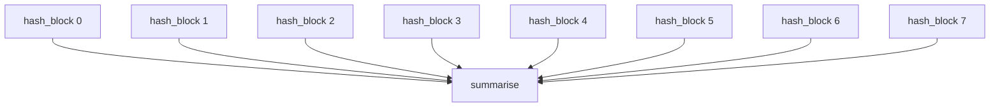

# Parallel Tasks

Minimal copy-paste-friendly example showing the `@task` decorator and `Worker(concurrency=N)`. Zero external dependencies.

**Run it:**

```bash
python examples/parallel_tasks.py
```

## Task Definitions

```python
from gigq import task

@task(timeout=30, max_attempts=2)
def hash_block(block_id, rounds=200_000):
    """Hash random data repeatedly to simulate a small workload."""
    data = os.urandom(64)
    for _ in range(rounds):
        data = hashlib.sha256(data).digest()
    return {"block_id": block_id, "sha256": data.hex()}

@task(timeout=10)
def summarise(total_blocks):
    """Runs only after all hash jobs complete."""
    return {"total_blocks": total_blocks, "status": "done"}
```

## Batch Submit + Concurrent Worker

```python
from gigq import JobQueue, Worker

queue = JobQueue("jobs.db")

for i in range(16):
    hash_block.submit(queue, block_id=i)

worker = Worker("jobs.db", concurrency=4)
worker.start()
```

## Workflow with Dependencies

Use `Workflow.add_task()` to build a fan-out/fan-in pipeline:

```python
from gigq import Workflow

wf = Workflow("hash_pipeline")

hash_jobs = []
for i in range(8):
    j = wf.add_task(hash_block, params={"block_id": i})
    hash_jobs.append(j)

wf.add_task(summarise, params={"total_blocks": 8}, depends_on=hash_jobs)
wf.submit_all(queue)
```



## Sample Output

```
Submitted 16 jobs
  16/16 completed in 1.3s (concurrency=4)
  block 0: fe9d08fc8ad3dbb974d795cec3e71059...
  block 1: 82775a31e01522b44e29b40fa1245ab8...
  block 2: f819d25b694185354f86ad310646fd29...

Submitted workflow: 8 hash jobs → 1 summary
  hash_block      completed
  hash_block      completed
  hash_block      completed
  hash_block      completed
  hash_block      completed
  hash_block      completed
  hash_block      completed
  hash_block      completed
  summarise       completed

Done.
```

## Source

Full runnable script: [`examples/parallel_tasks.py`](https://github.com/kpouianou/gigq/blob/main/examples/parallel_tasks.py)

For the full-featured demo with sequential-vs-parallel comparison, speedup chart, and crash recovery, see [Hyperparameter Tuning](hyperparameter-tuning.md).
