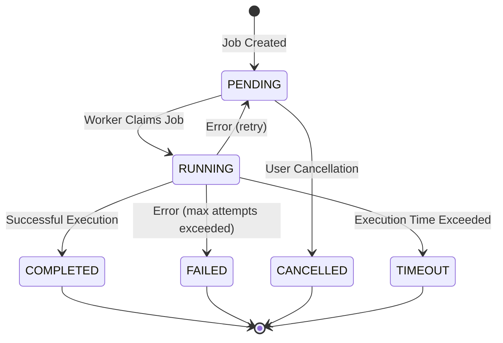

# GigQ: Lightweight Local Job Queue

<div style="text-align: center; margin: 30px 0;">
  <h1 style="font-size: 3.5rem; margin: 0; padding: 0;">
    <span style="color: #4f81e6;">Gig</span><span style="color: #60cdff;">Q</span>
  </h1>
  <p style="margin: 0; padding: 0; color: #a0aec0;">Lightweight SQLite Job Queue</p>
</div>

A job queue that lives in a single file. No Redis. No infrastructure. Just `pip install` and go.

GigQ is a small Python library that runs background work through a **SQLite** database on disk. It fits teams and side projects that have outgrown a raw `for` loop with `try`/`except`, but don't want to operate Redis, a broker, or cloud queue infrastructure. Define functions, enqueue them, and run one or more workers on any machine that can see the database file.

```python
from gigq import task, JobQueue, Worker

@task()
def greet(name="world"):
    return f"Hello, {name}!"

queue = JobQueue("jobs.db")
greet.submit(queue, name="Alice")
Worker("jobs.db").start()
```

## Key Capabilities

- **Retry & crash recovery** — automatic retries with backoff; stuck jobs are reclaimed if a worker crashes
- **Workflows with `parent_results`** — model pipelines as a DAG; dependent tasks receive parent return values automatically
- **Concurrent workers** — multiple threads or processes coordinate through the database file
- **CLI** — submit jobs, start workers, and inspect queues from the command line
- **Zero dependencies** — just Python and SQLite, nothing else to install or run

## Job Lifecycle



## Installation

```bash
pip install gigq
```

## Next Steps

Check out the [Quick Start Guide](getting-started/quick-start.md) to start using GigQ.

## License

GigQ is released under the MIT License. See [LICENSE](https://github.com/kpouianou/gigq/blob/main/LICENSE) for details.
