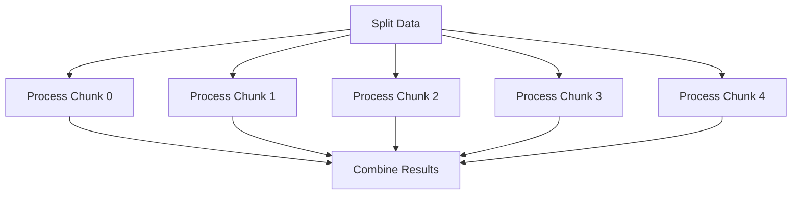
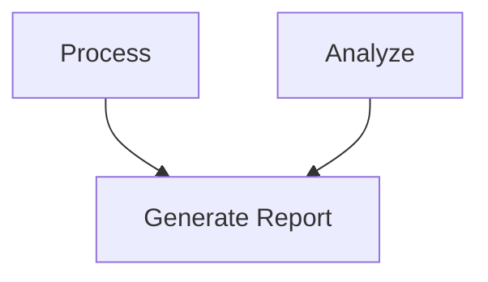

# Workflows

Workflows let you define and manage sequences of jobs with dependencies. Jobs run in dependency order, with independent jobs running in parallel when multiple workers are available.

## Creating a Workflow

```python
from gigq import Workflow, task

@task()
def download(url):
    return {"file": "data.csv", "rows": 1000}

@task()
def process(parent_results):
    data = next(iter(parent_results.values()))
    return {"processed": data["file"], "rows": data["rows"]}

@task()
def analyze(parent_results):
    data = next(iter(parent_results.values()))
    return {"analysis": f"Processed {data['rows']} rows"}

wf = Workflow("data_processing_pipeline")
step1 = wf.add_task(download, params={"url": "https://example.com/data.csv"})
step2 = wf.add_task(process, depends_on=[step1])
wf.add_task(analyze, depends_on=[step2])
```

## Passing Results Between Steps

When job B depends on job A, B can receive A's return value automatically. Declare a `parent_results` parameter on the dependent task. The worker injects a **dict** mapping each **parent job ID** to that job's deserialized result.

```python
from gigq import Workflow, JobQueue, task

@task()
def fetch(url):
    return {"url": url, "data": 1}  # example payload

@task()
def summarize(parent_results):
    # Values from all parent jobs, keyed by parent job id
    payloads = list(parent_results.values())
    return {"summary": len(payloads)}

wf = Workflow("pipeline")
job1 = wf.add_task(fetch, params={"url": "https://a.example"})
job2 = wf.add_task(fetch, params={"url": "https://b.example"})
job3 = wf.add_task(summarize, depends_on=[job1, job2])
```

**Auto vs explicit:** With the default `pass_parent_results=None` ("auto"), injection happens only if the function accepts `parent_results` or `**kwargs`. Set `pass_parent_results=False` on `Workflow.add_task()` to disable injection. Set `True` to always inject when there are dependencies.

## Fan-Out Pattern

A single job spawns multiple parallel jobs:

```python
@task()
def split_data():
    return {"chunks": 5}

@task()
def process_chunk(chunk_id, parent_results):
    source = next(iter(parent_results.values()))
    return {"chunk_id": chunk_id, "total": source["chunks"]}

wf = Workflow("fan_out")
split = wf.add_task(split_data)
chunks = []
for i in range(5):
    chunk = wf.add_task(process_chunk, params={"chunk_id": i}, depends_on=[split])
    chunks.append(chunk)
```

## Fan-In Pattern

Multiple parallel jobs converge to a single job that receives all parent results:

```python
@task()
def combine(parent_results):
    results = list(parent_results.values())
    return {"total_chunks": len(results)}

# Continues from fan-out above
wf.add_task(combine, depends_on=chunks)
```

Together, these create a diamond-shaped workflow:



## Multiple Dependencies

A job can depend on multiple other jobs:

```python
@task()
def generate_report(parent_results):
    # Receives results from both process and analyze steps
    return {"report": "done"}

wf = Workflow("multi_dep")
step_a = wf.add_task(process, params={"input": "a"})
step_b = wf.add_task(analyze, params={"input": "b"})
wf.add_task(generate_report, depends_on=[step_a, step_b])
```



## Submitting a Workflow

Once defined, submit all jobs to a queue:

```python
from gigq import JobQueue

queue = JobQueue("workflow_jobs.db")
job_ids = wf.submit_all(queue)
print(f"Submitted {len(job_ids)} jobs")
```

Workers process jobs in dependency order automatically.

## Monitoring Workflow Progress

```python
def check_workflow_status(queue, job_ids):
    for job_id in job_ids:
        status = queue.get_status(job_id)
        print(f"{status['name']}: {status['status']}")
```

Or use the CLI:

```bash
gigq --db workflow_jobs.db list
gigq --db workflow_jobs.db stats
```

## Best Practices

1. **Keep jobs atomic** — each job should perform a single, well-defined task.
2. **Set appropriate timeouts** — match each job's expected runtime.
3. **Design for restartability** — if a workflow is interrupted, workers resume from where they left off.
4. **Use meaningful job names** — clear names make monitoring and debugging easier.
5. **Use `parent_results` for data passing** — let the framework handle serialization rather than writing intermediate files.

## Next Steps

- [Error Handling](error-handling.md) — how GigQ handles errors in jobs and workflows
- [CLI Usage](cli.md) — managing workflows from the command line
- [Parallel Tasks example](../examples/parallel-tasks.md) — complete fan-out/fan-in example
